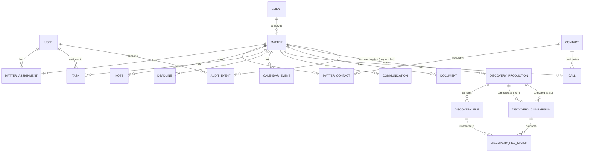

# Data Model

This describes the core entities for v1 planning. This is a design document,
not the implementation — the actual source of truth once built will be
`prisma/schema.prisma`. Field lists below are representative, not exhaustive;
expect refinement once real screens are built.

Nothing in this document has been implemented yet (no `schema.prisma` exists
yet in this groundwork phase).

## Entity overview

- **User** — firm staff (attorneys, paralegals, admins) who log into the
  system. Not to be confused with Client.
- **Client** — a person or entity the firm represents.
- **Contact** — any other person relevant to a matter who is not the client
  (witness, opposing counsel, judge, expert, investigator, etc.).
- **Matter** — a single case/engagement for a client.
- **MatterAssignment** — join table: which Users are assigned to a Matter,
  and in what role (lead attorney, associate attorney, paralegal, etc.).
- **MatterContact** — join table: which Contacts are relevant to a Matter,
  and in what role.
- **Note** — free-text note attached to a Matter.
- **Task** — actionable to-do attached to a Matter, assignable to a User.
- **Deadline** — a date-driven obligation attached to a Matter (court
  filing, statute of limitations, speedy trial, etc.), distinct from a Task
  because deadlines have legal consequences and need dedicated reminder
  logic.
- **CalendarEvent** — a scheduled event attached to a Matter (hearing,
  deposition, client meeting).
- **Communication** — a logged interaction (call, SMS, email, letter) tied
  to a Matter and, optionally, a Contact or the Client. In the future, calls
  originating from Vonage populate this alongside the dedicated `Call`
  entity below.
- **Call** — a phone call, eventually synced from Vonage. Split out from the
  generic `Communication` because calls have recording/transcript-specific
  fields and their own workflow (flagging, filing to the correct matter).
- **DiscoveryProduction** — one batch of discovery received on a Matter.
- **DiscoveryFile** — one file within a DiscoveryProduction, with its
  assigned identifier (Bates number or media ID) and metadata.
- **DiscoveryComparison** / **DiscoveryFileMatch** — records the result of
  comparing two productions to identify new/changed/duplicate/missing files.
- **Document** — a general (non-discovery) document tied to a Matter
  (pleadings, correspondence, contracts), referencing its Dropbox location.
- **AuditEvent** — an immutable log entry recording who did what to which
  record and when.

## Entity-relationship diagram

## Entities in detail

### User
Firm staff account.
- `id`, `email` (unique), `name`, `passwordHash`, `role`
  (`admin` | `attorney` | `paralegal` | `staff`), `active`, `createdAt`,
  `updatedAt`.

### Client
Person or entity the firm represents.
- `id`, `firstName`, `lastName`, `dateOfBirth`, `email`, `phone`, `address`,
  `notes`, `createdAt`, `updatedAt`.
- One Client can have multiple Matters over time (repeat client).

### Contact
Anyone relevant to a case who is not the client.
- `id`, `firstName`, `lastName`, `type`
  (`witness` | `opposing_counsel` | `judge` | `expert` | `investigator` |
  `other`), `organization`, `email`, `phone`, `notes`.

### Matter
A single case.
- `id`, `clientId` (FK → Client), `caseNumber`, `court`, `charges`
  (text/array), `status` (`open` | `closed` | `pending`), `openedDate`,
  `closedDate`, `createdAt`, `updatedAt`.

### MatterAssignment
Join table: staff assigned to a matter.
- `id`, `matterId` (FK), `userId` (FK), `role`
  (`lead_attorney` | `associate_attorney` | `paralegal` | `staff`),
  `assignedAt`.
- Enforces who is authorized to view/act on a matter (see
  `docs/SECURITY.md`).

### MatterContact
Join table: contacts relevant to a matter.
- `id`, `matterId` (FK), `contactId` (FK), `role` (free text or enum, e.g.
  "defense witness", "opposing counsel of record").

### Note
Free-text note on a matter.
- `id`, `matterId` (FK), `authorId` (FK → User), `body`, `pinned`,
  `createdAt`, `updatedAt`.

### Task
Actionable item.
- `id`, `matterId` (FK), `assignedToId` (FK → User, nullable), `title`,
  `description`, `dueDate`, `status`
  (`open` | `in_progress` | `done` | `cancelled`), `priority`
  (`low` | `normal` | `high`), `createdAt`, `updatedAt`.

### Deadline
Legally significant date obligation. Separate from Task because it needs
its own reminder cadence and cannot be silently marked "done" without an
audit trail.
- `id`, `matterId` (FK), `type`
  (`statute_of_limitations` | `speedy_trial` | `filing` | `other`), `date`,
  `description`, `reminderDaysBefore`, `satisfied` (boolean),
  `satisfiedAt`, `createdAt`, `updatedAt`.

### CalendarEvent
Scheduled event.
- `id`, `matterId` (FK), `title`, `type`
  (`hearing` | `deposition` | `meeting` | `other`), `startTime`, `endTime`,
  `location`, `notes`, `createdAt`, `updatedAt`.

### Communication
Generic logged interaction (email, letter, SMS, or a call not yet linked to
the dedicated Call record).
- `id`, `matterId` (FK), `contactId` (FK, nullable), `type`
  (`call` | `sms` | `email` | `letter`), `direction`
  (`inbound` | `outbound`), `occurredAt`, `summary`, `createdBy` (FK → User),
  `createdAt`.

### Call
Phone call — designed around future Vonage sync.
- `id`, `matterId` (FK, nullable until filed), `contactId` (FK, nullable),
  `vonageCallId` (nullable until integration exists), `direction`,
  `fromNumber`, `toNumber`, `occurredAt`, `durationSeconds`,
  `recordingDropboxPath` (nullable), `flagged` (boolean), `notes`,
  `filedBy` (FK → User, nullable), `filedAt` (nullable), `createdAt`.
- Unfiled calls (no `matterId`) represent the "search/flag/attach to a
  matter" workflow described in the project goals.

### DiscoveryProduction
One batch of discovery received on a matter.
- `id`, `matterId` (FK), `label` (e.g. "Initial Production",
  "Supplemental #2"), `source` (e.g. prosecuting agency name),
  `receivedDate`, `batesPrefix`, `batesStart`, `batesEnd`, `reviewStatus`
  (`not_started` | `in_review` | `complete`), `notes`, `createdAt`.

### DiscoveryFile
One file within a production.
- `id`, `productionId` (FK), `originalFilename`,
  `identifier` (Bates number for paginated docs, or a consistent media ID
  for video/audio/photo), `fileType`
  (`pdf` | `video` | `audio` | `photo` | `other`), `contentHash` (for
  duplicate/change detection), `dropboxPathOriginal` (preserved, untouched
  original), `dropboxPathNumbered` (numbered/processed copy, nullable),
  `pageCount` (nullable), `createdAt`.

### DiscoveryComparison — implemented, but hand-seeded (not computed)
Result of comparing two productions.
- `id`, `matterId` (FK), `fromProductionId` (FK →
  DiscoveryProduction), `toProductionId` (FK → DiscoveryProduction),
  `runAt`.
- **Implementation note:** this entity and `DiscoveryFileMatch` exist in
  the schema ahead of their originally-planned Phase 4 slot, specifically
  to back a visual mockup of the comparison feature for a firm demo. Rows
  are seeded by hand (`prisma/seed.ts`) to look like a plausible result —
  there is no content-hashing or diffing engine yet. Treat any comparison
  shown in the UI as illustrative, not as real analysis of real files.

### DiscoveryFileMatch
One line item of a comparison result.
- `id`, `comparisonId` (FK), `status`
  (`new` | `changed` | `duplicate` | `missing`), `filename` (display name —
  works even for `missing` rows where no current file exists), `identifier`
  (nullable), `fileId` (FK → DiscoveryFile, nullable — set for
  new/changed/duplicate rows, null for `missing` since by definition the
  file isn't in the newer production), `notes`.

### Document
General, non-discovery document.
- `id`, `matterId` (FK), `category`
  (`pleading` | `correspondence` | `contract` | `other`),
  `dropboxPath`, `uploadedBy` (FK → User), `uploadedAt`, `notes`.

### AuditEvent
Immutable log of who did what.
- `id`, `actorId` (FK → User, nullable for system actions), `action`
  (e.g. `create`, `update`, `delete`, `view_discovery`, `export`),
  `entityType` (e.g. `Matter`, `DiscoveryFile`), `entityId`, `matterId`
  (FK, nullable — denormalized for fast "show me everything on this
  matter" queries), `metadata` (`jsonb`, structured details of the change),
  `occurredAt`, `ipAddress` (nullable).
- Append-only. No update/delete operations should ever be exposed for this
  table.

## Notes on design choices

- **Contacts are separate from Clients.** A person can appear as a witness
  on one matter and later become a client on another; keeping them as
  distinct entities (joined per-matter via `MatterContact`) avoids
  conflating "who we represent" with "who is involved."
- **Deadlines are separate from Tasks** because missing one has legal
  consequences (e.g., statute of limitations). They need their own
  satisfied/audit semantics rather than a generic "done" checkbox.
- **Call is separate from Communication** because calls carry
  telephony-specific data (recording path, Vonage call ID, flag/file
  workflow) that doesn't apply to a logged email or letter. Once a call is
  filed to a matter, a corresponding `Communication` row can optionally be
  created for a unified matter timeline — worth revisiting once the
  Vonage integration is actually built.
- **DiscoveryFile keeps both an original and (optionally) a numbered path**
  to satisfy the requirement that original files are always preserved
  untouched.
- **AuditEvent is intentionally generic/polymorphic** (`entityType` +
  `entityId`) rather than having a separate audit table per entity, so
  every future entity gets audit logging for free without a schema change.
- **DiscoveryComparison/DiscoveryFileMatch were pulled forward from Phase 4**
  to support a visual, seeded demo of the "compare re-served discovery"
  feature (see docs/ROADMAP.md). The tables are real; the diffing logic
  that would populate them from actual file comparisons is not.
- **CalendarEvent is separate from Deadline** even though both are "a date
  on a matter": a Deadline carries legal consequences and a
  satisfied/audit lifecycle (statute of limitations, filing deadlines); a
  CalendarEvent is just something scheduled (a hearing, a meeting) with no
  such lifecycle. A hearing that's also legally significant may reasonably
  have both a CalendarEvent and a linked Deadline — that linkage isn't
  modeled yet.
